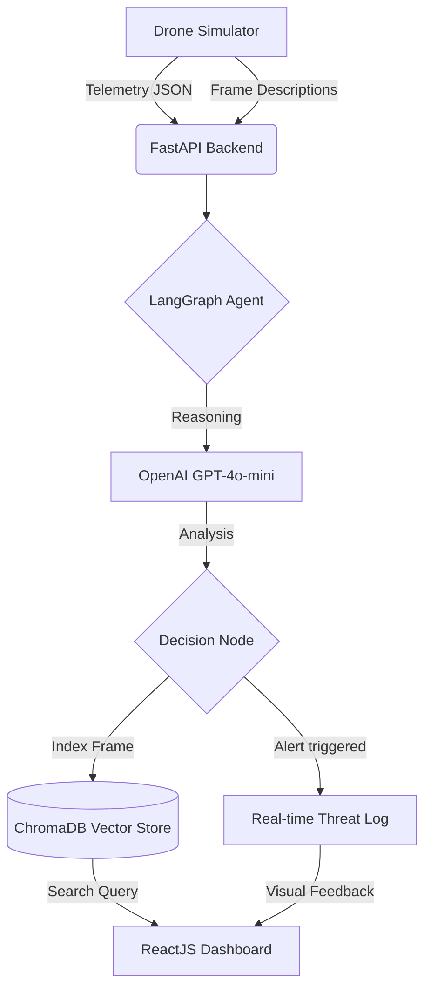

# 🚁 Drone Security Analyst System

Real-time drone security analysis powered by AI. Detects threats through telemetry analysis and vision understanding using GPT-4o-mini and LangGraph reasoning.


📹 **[Watch the 5-Minute Explanation Video](https://youtu.be/7MV-EhRNjcU)**

---

## 🎯 Key Features

- ✅ Real-time threat detection with AI reasoning
- ✅ Live telemetry dashboard (altitude, battery, GPS)
- ✅ Vision analysis with natural language descriptions
- ✅ Smart alerts for suspicious activity
- ✅ Semantic search on historical footage
- ✅ LangGraph agentic workflows
- ✅ REST API with clean endpoints
- ✅ Cyberpunk-themed responsive UI

---

## 🏗️ System Architecture



**Workflow:**
1. Drone simulator generates telemetry + frame descriptions
2. LangGraph orchestrates reasoning pipeline
3. GPT-4o-mini analyzes data for security threats
4. Frames indexed in ChromaDB for semantic search
5. Dashboard displays live alerts & historical search results

---

## 🚀 Quick Start

### Prerequisites
- Python 3.10+ | Node.js 18+ | OpenAI API Key

### Setup in 3 Steps

**1. Backend**
```bash
cd backend
python -m venv venv
venv\Scripts\activate  # Windows
# source venv/bin/activate  # macOS/Linux
pip install -r requirements.txt
echo OPENAI_API_KEY=sk-your-key-here > .env
uvicorn main:app --reload
```
→ Runs on `http://localhost:8000`

**2. Frontend**
```bash
cd frontend
npm install
npm run dev
```
→ Runs on `http://localhost:5173`

**3. Open Dashboard**
Navigate to **http://localhost:5173** and watch live data stream in!

---

## 📡 API Endpoints

| Endpoint | Method | Description |
|----------|--------|-------------|
| `/status` | GET | Current drone telemetry (altitude, battery, GPS) |
| `/stream` | GET | Latest VLM video frame description |
| `/process-tick` | POST | Run one AI analysis cycle (threat detection + indexing) |
| `/search?query=...` | GET | Search historical frames (e.g., `?query=blue truck`) |
| `/` | GET | Health check |

**Example API calls:**
```bash
curl http://localhost:8000/status
curl -X POST http://localhost:8000/process-tick
curl "http://localhost:8000/search?query=blue%20truck"
```

---

## 📁 Project Structure

```
Drone-Simulation-System/
├── backend/
│   ├── main.py              # FastAPI application
│   ├── requirements.txt      # Python dependencies
│   ├── .env                 # Environment variables (create this)
│   ├── chroma_db/           # Vector database storage
│   └── core/
│       ├── simulation.py     # DroneSimulator
│       ├── agent.py         # LangGraph workflow
│       └── indexing.py      # ChromaDB FrameIndexer
│
├── frontend/
│   ├── package.json         # Node dependencies
│   ├── src/
│   │   ├── App.jsx          # Main dashboard component
│   │   ├── main.jsx         # React entry point
│   │   └── index.css        # Styles
│   └── vite.config.js       # Build config
│
└── README.md

---

## 🔄 How Threat Detection Works

1. **Data Generation** → Simulator produces telemetry + frame descriptions
2. **LangGraph Orchestration** → Routes data through reasoning pipeline
3. **AI Analysis** → GPT-4o-mini evaluates telemetry + vision for threats
4. **Vector Indexing** → Frame stored in ChromaDB with embeddings
5. **Real-time Alerts** → Suspicious activity triggers instant notifications
6. **Semantic Search** → Query historical data with natural language

**Alert Triggers:**
- Suspicious activity (loitering, unknown vehicles)
- Unauthorized timing (activities after 10 PM)
- Safety concerns (altitude < 5 meters)

---

## 🛠️ Tech Stack

**Backend:** FastAPI • LangChain • LangGraph • ChromaDB • OpenAI GPT-4o-mini • Uvicorn

**Frontend:** React 18 • Vite • Tailwind CSS • Axios • Lucide Icons

---

## 🐛 Troubleshooting

| Issue | Solution |
|-------|----------|
| `OPENAI_API_KEY not found` | Create `.env` file in backend with your API key |
| `Connection refused on port 8000` | Ensure you're in backend directory and ran `uvicorn main:app --reload` |
| `ModuleNotFoundError: No module named 'langchain'` | Activate venv and run `pip install -r requirements.txt` |
| `Cannot find module 'axios'` | Run `npm install` in frontend directory |
| `Blank dashboard or no data` | Check browser console. Verify both servers are running on 8000 & 5173 |

---

## 🚀 Next Steps

- Try searching: `"blue truck"`, `"loitering"`, `"person hoodie"`
- Check alerts in the threat log
- Explore the code in `backend/core/` to understand the LangGraph workflow
- Check the video explanation: https://youtu.be/7MV-EhRNjcU

---

## 📈 Future Enhancements

- Real drone integration (DJI SDK)
- Multi-drone support
- WebSocket real-time streaming
- PostgreSQL database persistence
- Authentication & authorization
- Mobile app

---

## 📝 License

MIT License - Open source and free to use.

---

## 🤝 Support

- 📹 Watch the video: https://youtu.be/7MV-EhRNjcU
- 💬 Check the troubleshooting section above
- 🔍 Review the architecture diagram at the top

**Built with ❤️ for advanced security systems**
